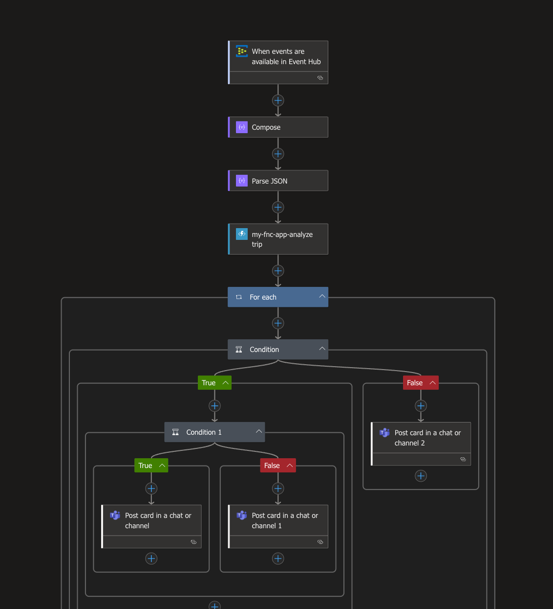

# 🚕 Real‑Time Trip Event Analysis 
## 📖 Overview

This project enables real-time monitoring of taxi trip data streams using Azure Event Hub, Azure Functions, and Logic Apps. It flags anomalous trip events and delivers alerts via Adaptive Cards to Microsoft Teams, improving oversight and operational awareness in taxi dispatch networks.

---

## 🧠 Architecture

The system design comprises:

- **Azure Event Hub**: Ingests incoming trip events (simulated JSON data).
- **Azure Function**: Processes each trip, auto-classifying based on distance, passenger count, and payment type.
- **Logic App**: Orchestrates event processing, calling the Function and posting results to Teams.
- **Microsoft Teams**: Receives formatted Adaptive Cards via webhook for both flagged and normal trips.



---

## ⚙️ Azure Function — `analyze_trip`

Function logic (Python HTTP trigger):

```python
# function-app/analyze_trip/__init__.py

import azure.functions as func
import logging, json

app = func.FunctionApp(http_auth_level=func.AuthLevel.ANONYMOUS)

@app.route(route="")
def analyze_trip(req: func.HttpRequest) -> func.HttpResponse:
    try:
        input_data = req.get_json()
        trips = input_data if isinstance(input_data, list) else [input_data]
        results = []

        for rec in trips:
            trip = rec.get("ContentData", {})
            vendor = trip.get("vendorID")
            dist = float(trip.get("tripDistance", 0))
            pax = int(trip.get("passengerCount", 0))
            pay = str(trip.get("paymentType"))
            insights = []
            if dist > 10: insights.append("LongTrip")
            if pax > 4: insights.append("GroupRide")
            if pay == "2": insights.append("CashPayment")
            if pay == "2" and dist < 1:
                insights.append("SuspiciousVendorActivity")

            results.append({
                "vendorID": vendor,
                "tripDistance": dist,
                "passengerCount": pax,
                "paymentType": pay,
                "insights": insights,
                "isInteresting": bool(insights),
                "summary": (f"{len(insights)} flags: {', '.join(insights)}"
                            if insights else "Trip normal")
            })

        return func.HttpResponse(
            body=json.dumps(results),
            status_code=200,
            mimetype="application/json"
        )
    except Exception as e:
        logging.error(f"Error: {e}")
        return func.HttpResponse(f"Error: {str(e)}", status_code=400)
```

---

## 🧩 Logic App Workflow

You can download the full Logic App definition here: [`logic-app-trip-monitoring.json`](./logic-app-trip-monitoring.json)

### Key Steps:

1. **Trigger**: “When events are available in Event Hub” (batch mode, polling every minute).
2. Decode and parse Message content using `Compose` and `Parse JSON`.
3. Invoke the Azure Function via HTTP.
4. **For Each** result item:
   - **If `isInteresting == true`**:
     - If `insights` contains `SuspiciousVendorActivity`: post **Suspicious Vendor Activity** card.
     - Else: post **Interesting Trip Detected** card.
   - **Else**: post **Trip Analyzed – No Issues** card.
5. Teams cards are sent using the Teams connector with an incoming webhook targeting a channel in your tenant.

---

## 🔍 Sample Input & Output

**Input example:**
```json
{"ContentData":{"vendorID":"V003","tripDistance":"0.4","passengerCount":"1","paymentType":"2"}}
```

**Azure Function result:**
```json
[{
  "vendorID":"V003",
  "tripDistance":0.4,
  "passengerCount":1,
  "paymentType":"2",
  "insights":["CashPayment","SuspiciousVendorActivity"],
  "isInteresting":true,
  "summary":"2 flags: CashPayment, SuspiciousVendorActivity"
}]
```

Teams receives a **⚠️ Suspicious Vendor Activity Detected** Adaptive Card via the Logic App.

---

## 💬 Adaptive Cards Deployed

- **✅ Trip Analyzed – No Issues**
- **🚨 Interesting Trip Detected**
- **⚠️ Suspicious Vendor Activity Detected**

These cards display vendor ID, distance, passenger count, payment method, insights, and/or summary.

---

## 📁 Repository Structure

```
.
├── README.md
├── flowchat.png
├── logic-app-trip-monitoring.json
├── send_to_eventhub.py
```

---

## 🚀 Extensions & Learnings

### What Could You Add?
- Persist analyzed results into Azure Cosmos DB or Blob Storage.
- Build a Power BI dashboard for operational metrics.
- Use Logic App error handling and retry policies.
- Add notification filtering by vendor or geographic region.

### Key Lessons
- Processing streaming data with Azure Event Hub and Logic Apps.
- Real‑time decision making using Azure Functions.
- Driving Teams notifications via Adaptive Cards in Logic Apps.

---

## 📽 Demo & Submission

- **Demo video (3–5 min)**: demonstrate sending sample events, Function result, Teams activity.
- **GitHub assignment submission**: link to this repository, include Logic App JSON, Function code, README, and demo video URL.

---
